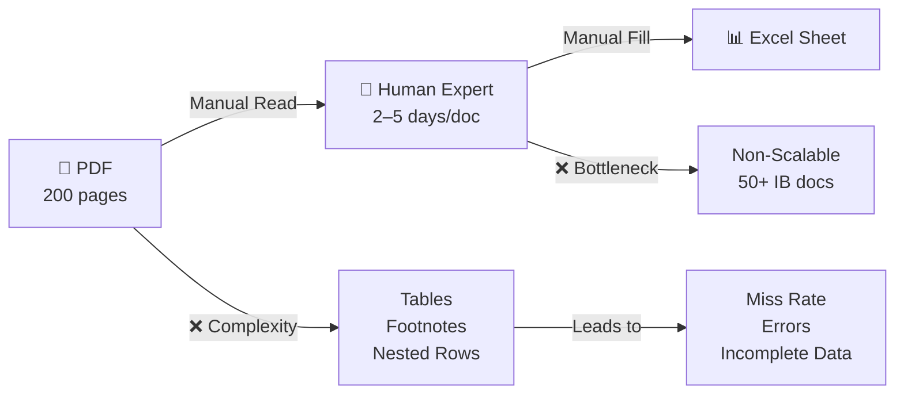
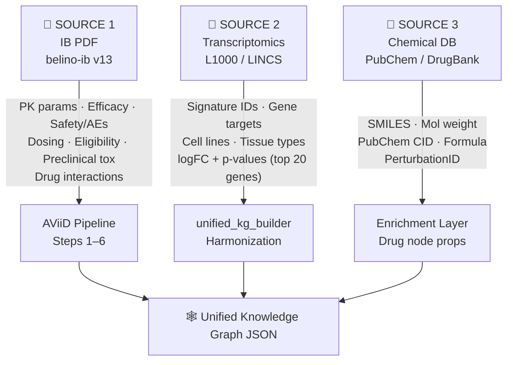
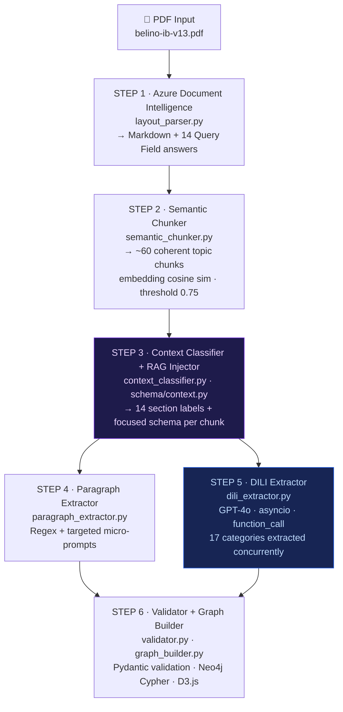
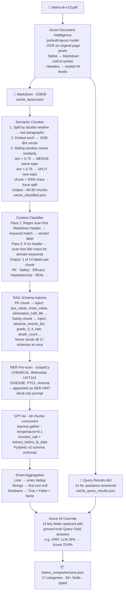
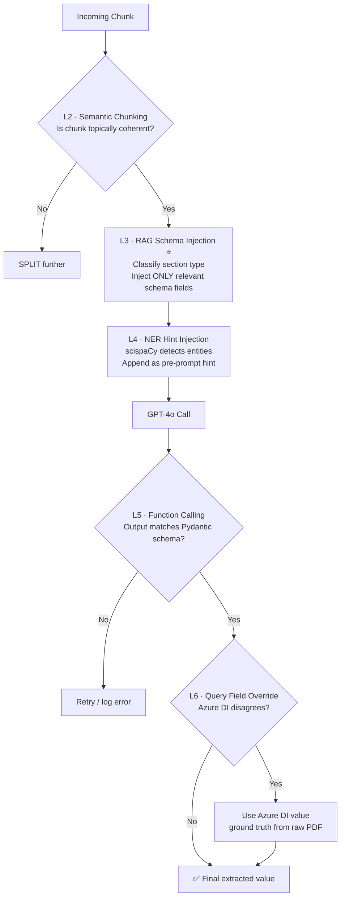
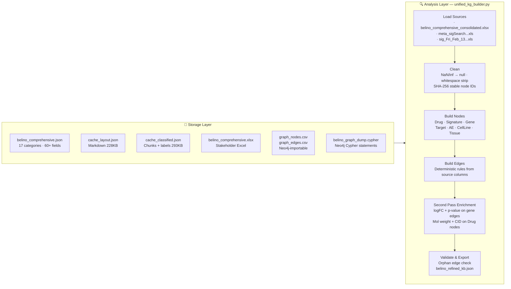
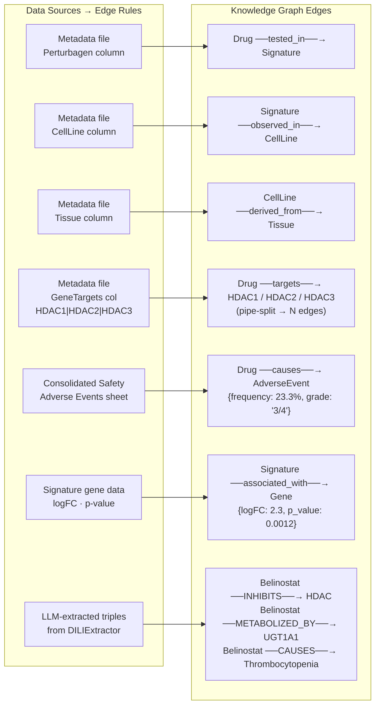
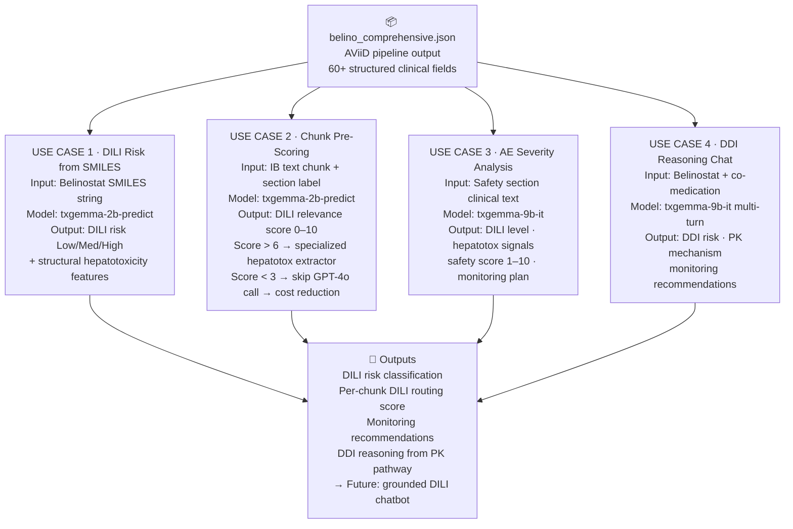

# AViiD — Pipeline Presentation Slides
> **Audience:** Product Manager · **Drug:** Belinostat (IB v13) · **Date:** March 2026

---

## Slide 1 — Title

**Title:** AViiD – Automated Investigator Brochure Data Extraction Pipeline  
**Subtitle:** Context Engineering + Azure AI + GPT-4o → Structured Clinical Knowledge Graph  
**Tags:** Context Engineering · Semantic Chunking · RAG Schema Injection · Knowledge Graph · GPT-4o · Azure OpenAI  
**Bottom line:** Belinostat (IB v13) · March 2026

---

## Slide 2 — The Problem

**Title:** Manual IB Extraction is Slow, Error-Prone & Unscalable

**Pointers:**
- Pharmaceutical IB documents = 100–300 pages of dense, unstructured clinical data
- Manual process: human expert reads PDF → fills Excel → 2–5 days per document
- Values buried in complex tables, footnotes, multi-level nested rows → high miss rate
- Not scalable across a drug portfolio of 50+ compounds
- Must extract: **17 categories / 60+ unique fields** per IB

| Metric | Value |
|--------|-------|
| Pages per IB | 300+ |
| Categories to extract | 17 |
| Unique fields | 60+ |
| AViiD runtime | **~15 seconds** (vs. days manually) |

---

## Slide 3 — Data Sources

**Title:** What Data Are We Feeding the Pipeline?

**Pointers:**
- Three distinct data source types: clinical document, transcriptomics, chemical identity

---

## Slide 4 — Pipeline Architecture

**Title:** 6-Step AI Pipeline — End-to-End in ~15 Seconds

**Pointers:**
- Entire pipeline runs **async** (`asyncio.gather`) — all 60+ LLM calls in parallel
- Three-level JSON cache avoids re-calling Azure APIs on re-runs
- Azure DI Query Field results **override** LLM values post-extraction (ground truth)

---

## Slide 5 — PDF to Structured Data: Full Extraction Flow

**Title:** How We Extract from PDF — Step by Step

---

## Slide 6 — Context Engineering Deep Dive

**Title:** 6 Layers That Eliminate Hallucination (~60% reduction)

> Context engineering = precisely crafting what the LLM sees at each step

| Layer | Technique | What it solves |
|-------|-----------|----------------|
| **L1** | Azure DI → Markdown | Tables preserved as `\|col\|col\|` — LLM reads structure not flat text |
| **L2** | Embedding cosine similarity chunking | No mid-table cuts; related paragraphs stay together |
| **L3** | RAG Schema Injection ⭐ | PK chunk → only PK fields; Safety → only AE fields; never all 17 |
| **L4** | scispaCy NER hints | Primes LLM: "look for Belinostat, HDAC1, PTCL in this chunk" |
| **L5** | OpenAI function_call + Pydantic v2 | Enforces exact JSON schema; no field name drift |
| **L6** | Azure DI Query Field override | Two AI systems cross-validate; Azure PDF-native answer wins |

---

## Slide 7 — Storage, Harmonization & Analysis

**Title:** How Data is Stored and Analyzed

**Key design decisions:**
- All ID matching: **strict exact-string only** — prefer dropping a connection over guessing wrong
- Top 20 genes per signature by absolute logFC (quality over quantity)
- In-memory graph (~70 nodes) — Neo4j migration path for scale > 100K nodes

---

## Slide 8 — Knowledge Graph: Meaningful Nodes & Edges

**Title:** How Meaningful Relationships Are Formed

**Why edges are meaningful — not just data dumps:**
- Edges carry **quantitative properties** — not just "Drug causes AE" but *how often* (23.3%) and *what grade* (3/4)
- Gene edges weighted by statistical significance: logFC + p-value — only real associations survive
- All triples are **SPARQL/Cypher queryable** in Neo4j
  - Example: *"Which genes are associated with Belinostat signatures in liver tissue?"*
- Node IDs are deterministic (SHA-256) → multiple pipeline runs produce identical, mergeable graphs

---

## Slide 9 — TxGemma Integration Plan

**Title:** TxGemma — AI-Grounded Toxicity Prediction Layer

**What is TxGemma:**
- Google DeepMind's therapeutics-domain LLM — trained on molecular biology, clinical safety literature, and Therapeutics Data Commons (TDC) benchmarks
- Two variants: `txgemma-2b-predict` (property prediction) · `txgemma-9b-it` (chat / multi-turn reasoning)

**Model parameters:**

| Parameter | Value | Why |
|-----------|-------|-----|
| `torch_dtype` | `bfloat16` | Memory-efficient on GPU |
| `device_map` | `auto` | Auto-uses available GPU |
| `do_sample` | `False` | Deterministic — clinical use |
| `temperature` | `1.0` (greedy with do_sample=False) | No randomness in predictions |
| `max_new_tokens` | 80 (scoring) · 400 (full analysis) | Task-adjusted |
| `quantization` | 4-bit NF4 via `bitsandbytes` | Fits 2B on free T4 GPU (~4GB VRAM) |
| `quant compute dtype` | `bfloat16` | Accuracy-memory balance |

**Prompt engineering technique:**
- Uses **Gemma chat template**: `<start_of_turn>user ... <end_of_turn><start_of_turn>model`
- Role-play prompting: *"You are a clinical safety analyst reviewing an Investigator Brochure"*
- Structured output format: `Score: X/10 | Reason: [one sentence]` for chunk scoring tasks

**Hardware tiers:**

| Tier | GPU | Model | Use |
|------|-----|-------|-----|
| Free Colab | T4 (15GB VRAM) | txgemma-2b-predict | DILI scoring + property prediction |
| Colab Pro | A100 (40GB) | txgemma-9b-it | Chat, DDI reasoning, AE analysis |

**What we get:**
- ✅ DILI risk classification from molecular structure (SMILES → Low/Med/High/Severe)
- ✅ Per-chunk DILI relevance score → intelligent routing, reduced GPT-4o API cost  
- ✅ Monitoring recommendations grounded in clinical text
- ✅ Drug-drug interaction reasoning via UGT1A1 metabolism pathway
- 🔮 Future: grounded DILI chatbot — answers *"Why is Belinostat hepatotoxic?"* citing extracted knowledge graph
