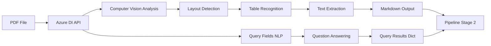
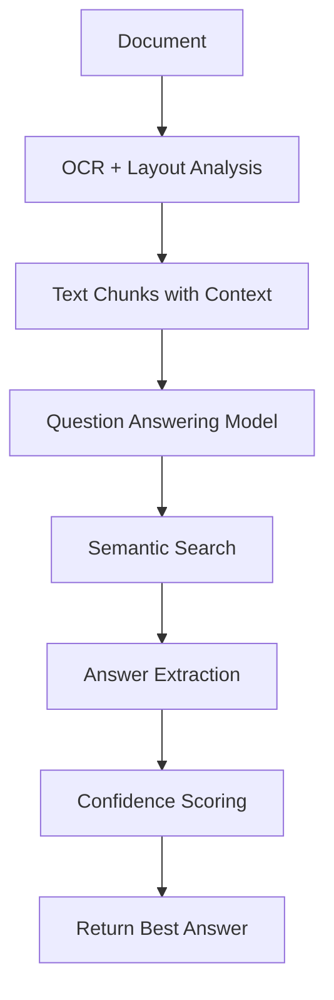

# Azure Document Intelligence - Deep Dive

## Overview

Azure Document Intelligence (formerly Form Recognizer) is Microsoft's cloud-based OCR and document understanding service. We use it to convert PDF documents into structured markdown while extracting specific data points through Query Fields.

---

## Architecture: How Azure DI Fits In



---

## Code Structure: `layout_parser.py`

### File Location
[`src/layout_parser.py`](file:///d:/AViiD/Team%201/src/layout_parser.py)

### Class Structure

```python
class LayoutParser:
    def __init__(self):
        # 1. Initialize Azure client
        # 2. Define Query Fields
    
    def analyze_document(self, file_path: str) -> Tuple[str, Dict]:
        # 3. Call Azure API
        # 4. Parse results
        # 5. Return markdown + query results
```

---

## Step-by-Step Code Explanation

### Step 1: SDK Initialization

```python
from azure.ai.documentintelligence import DocumentIntelligenceClient
from azure.ai.documentintelligence.models import DocumentAnalysisFeature
from azure.core.credentials import AzureKeyCredential

class LayoutParser:
    def __init__(self):
        self.client = DocumentIntelligenceClient(
            endpoint=Config.AZURE_DOCUMENT_INTELLIGENCE_ENDPOINT,
            credential=AzureKeyCredential(Config.AZURE_DOCUMENT_INTELLIGENCE_KEY)
        )
```

**What's Happening:**
- **SDK**: `azure-ai-documentintelligence` (v1.0+)
- **Endpoint**: Azure service URL (e.g., `https://eastus.api.cognitive.microsoft.com/`)
- **Credential**: API key for authentication
- **Client**: Handles HTTP requests, retries, error handling

**Configuration (`.env` file):**
```
AZURE_DOCUMENT_INTELLIGENCE_ENDPOINT=https://your-resource.cognitiveservices.azure.com/
AZURE_DOCUMENT_INTELLIGENCE_KEY=your-api-key-here
```

---

### Step 2: Query Fields Definition

```python
self.query_fields = [
    # Efficacy
    {"name": "overall_response_rate", "query": "What is the overall response rate (ORR) percentage?"},
    {"name": "median_pfs", "query": "What is the median progression-free survival (PFS) in months?"},
    
    # Pharmacokinetics
    {"name": "elimination_half_life", "query": "What is the elimination half-life or t1/2?"},
    {"name": "plasma_protein_binding", "query": "What is the plasma protein binding percentage?"},
    
    # Safety
    {"name": "hepatic_exclusion_bilirubin", "query": "What are the exclusion criteria for bilirubin?"},
]
```

**Field Structure:**
- **`name`**: Internal identifier (must match regex `^[\p{L}\p{M}\p{N}_]{1,64}$`)
  - ✅ Valid: `median_pfs`, `overall_response_rate`
  - ❌ Invalid: `median PFS`, `ORR (%)`, `response-rate`
- **`query`**: Natural language question for Azure's NLP model

**Query Design Best Practices:**
1. **Be specific**: "median PFS in months" > "PFS"
2. **Include synonyms**: "t1/2 or elimination half-life"
3. **Specify units**: "percentage", "months", "mg/m²"
4. **Avoid ambiguity**: "Grade 3-4 Anemia rate" > "Anemia"

---

### Step 3: API Call

```python
def analyze_document(self, file_path: str) -> Tuple[str, Dict[str, Any]]:
    try:
        # Build query fields dict (field_name: query_string)
        query_fields_dict = {q["name"]: q["query"] for q in self.query_fields}
        
        with open(file_path, "rb") as f:
            # Call Azure API
            poller = self.client.begin_analyze_document(
                "prebuilt-layout",                                    # Model
                body=f,                                               # PDF bytes
                content_type="application/pdf",                       # MIME type
                output_content_format="markdown",                     # Output format
                features=[DocumentAnalysisFeature.QUERY_FIELDS],      # Enable Query Fields
                query_fields=query_fields_dict                        # Questions
            )
        
        result: AnalyzeResult = poller.result()  # Wait for completion
```

**API Parameters Explained:**

#### `"prebuilt-layout"` (Model)
- **What it is**: Pre-trained model for general document layout
- **Capabilities**:
  - Text extraction (OCR)
  - Table detection & extraction
  - Section/paragraph detection
  - Reading order analysis
- **Alternatives**:
  - `prebuilt-read`: Text-only (no tables)
  - `prebuilt-document`: General documents
  - Custom models: Train on your own data

#### `output_content_format="markdown"`
- **What it does**: Converts document structure to markdown
- **Example Output**:
  ```markdown
  # Clinical Efficacy
  
  ## Overall Response Rate
  
  The ORR was 25.6% (95% CI: 18.5-33.8).
  
  | Study | N | ORR |
  |-------|---|-----|
  | CLN-19 | 129 | 25.6% |
  ```

#### `features=[DocumentAnalysisFeature.QUERY_FIELDS]`
- **What it does**: Enables the Query Fields feature
- **Required**: Must be set to use `query_fields` parameter
- **Other features**:
  - `LANGUAGES`: Detect languages
  - `BARCODES`: Extract barcodes
  - `FORMULAS`: Extract mathematical formulas

#### `query_fields=query_fields_dict`
- **Format**: `Dict[str, str]` mapping field names to questions
- **Example**:
  ```python
  {
      "median_pfs": "What is the median PFS in months?",
      "orr": "What is the overall response rate?"
  }
  ```

---

### Step 4: How Query Fields Work (Under the Hood)

#### Azure's Query Fields Pipeline



#### Example: "What is the median PFS in months?"

**Step 1: Document Analysis**
```
Azure identifies relevant sections:
- "Clinical Efficacy Results"
- "Progression-Free Survival"
- Tables with PFS data
```

**Step 2: Semantic Search**
```
Azure's NLP model understands:
- "PFS" = "progression-free survival"
- "median" = middle value
- "months" = time unit
```

**Step 3: Context Extraction**
```
Found text: "The median PFS was 5.5 months (95% CI: 4.2-7.1)"
```

**Step 4: Answer Extraction**
```
Extracted value: "5.5 months"
Confidence: High (exact match with units)
```

**Step 5: Return Result**
```python
{
    "median_pfs": "5.5 months"
}
```

---

### Step 5: Response Parsing

```python
result: AnalyzeResult = poller.result()

# Extract markdown content
markdown_content = result.content  # Full document as markdown string

# Extract query field results
query_results = {}
if result.documents and len(result.documents) > 0:
    doc = result.documents[0]
    if hasattr(doc, 'fields') and doc.fields:
        # Azure returns fields with the field names we provided
        for field_name in query_fields_dict.keys():
            if field_name in doc.fields:
                field_value = doc.fields[field_name]
                # Extract the actual value
                if hasattr(field_value, 'content'):
                    query_results[field_name] = field_value.content
                elif hasattr(field_value, 'value'):
                    query_results[field_name] = str(field_value.value)

return markdown_content, query_results
```

**Response Structure:**

```python
# result.content (markdown)
"# Investigator's Brochure\n\n## Clinical Efficacy\n\nORR: 25.6%..."

# result.documents[0].fields (query results)
{
    "median_pfs": DocumentField(
        value_type="string",
        content="5.5 months",
        confidence=0.98
    ),
    "overall_response_rate": DocumentField(
        value_type="string",
        content="25.6%",
        confidence=0.95
    )
}
```

---

## Markdown Output Format

### Tables

**Input (PDF):**
```
┌─────────┬─────┬──────┐
│ Study   │ N   │ ORR  │
├─────────┼─────┼──────┤
│ CLN-19  │ 129 │ 25.6%│
└─────────┴─────┴──────┘
```

**Output (Markdown):**
```markdown
| Study | N | ORR |
| --- | --- | --- |
| CLN-19 | 129 | 25.6% |
```

**Benefits:**
- ✅ Preserves column alignment
- ✅ Maintains header/data separation
- ✅ Easy to parse programmatically

### Headings

**Input (PDF):**
```
Clinical Efficacy Results (bold, 16pt)
  Overall Response Rate (bold, 14pt)
    Study CLN-19 (bold, 12pt)
```

**Output (Markdown):**
```markdown
# Clinical Efficacy Results
## Overall Response Rate
### Study CLN-19
```

### Lists

**Input (PDF):**
```
• Nausea (38.8%)
• Fatigue (28.7%)
• Vomiting (24.0%)
```

**Output (Markdown):**
```markdown
- Nausea (38.8%)
- Fatigue (28.7%)
- Vomiting (24.0%)
```

---

## Error Handling

### Common Errors & Solutions

#### 1. Invalid Query Field Name
```python
# ❌ Error: Special characters not allowed
query_fields = {"median-pfs": "What is median PFS?"}

# Error: InvalidParameter - field name must match ^[\p{L}\p{M}\p{N}_]{1,64}$

# ✅ Solution: Use underscores
query_fields = {"median_pfs": "What is median PFS?"}
```

#### 2. Missing Features Parameter
```python
# ❌ Error: Query fields specified without enabling feature
poller = client.begin_analyze_document(
    "prebuilt-layout",
    query_fields={"pfs": "What is PFS?"}  # Missing features parameter
)

# Error: InvalidParameter - features=queryFields parameter is required

# ✅ Solution: Add features parameter
poller = client.begin_analyze_document(
    "prebuilt-layout",
    features=[DocumentAnalysisFeature.QUERY_FIELDS],
    query_fields={"pfs": "What is PFS?"}
)
```

#### 3. API Timeout
```python
try:
    result = poller.result()  # May timeout for large documents
except Exception as e:
    print(f"Azure API failed: {e}")
    # Fallback: Use markdown-only extraction
    return markdown_content, {}
```

---

## Query Fields vs. LLM Extraction

### When to Use Query Fields

| Scenario | Query Fields | LLM Extraction |
|----------|--------------|----------------|
| **Numeric data** (PFS, OS, percentages) | ✅ More accurate | ⚠️ May hallucinate |
| **Specific values** (Bilirubin cutoff) | ✅ Precise | ⚠️ May miss context |
| **Tables** (Study IDs, N values) | ✅ Preserves structure | ✅ Good with markdown |
| **Complex reasoning** (Calculate derived values) | ❌ Limited | ✅ Better |
| **Narrative text** (Warnings, descriptions) | ❌ Not suitable | ✅ Better |

### Example: Why Query Fields for PFS?

**Document Text:**
```
The median progression-free survival was 5.5 months (95% CI: 4.2-7.1).
Time to progression was similar at 5.3 months.
```

**Query Fields:**
```python
query: "What is the median PFS in months?"
result: "5.5 months"  # ✅ Correct, ignores "time to progression"
```

**LLM Extraction:**
```python
prompt: "Extract median PFS"
result: "5.5 months" or "5.3 months"  # ⚠️ May confuse with TTP
```

---

## Performance Characteristics

### API Latency
- **Small docs** (<10 pages): ~10-15 seconds
- **Medium docs** (10-50 pages): ~20-30 seconds
- **Large docs** (50+ pages): ~30-60 seconds

### Query Fields Overhead
- **Without Query Fields**: ~20 seconds
- **With Query Fields** (15 queries): ~30 seconds
- **Overhead**: ~10 seconds (worth it for precision)

### Cost (Azure Pricing)
- **Prebuilt-layout**: $10 per 1,000 pages
- **Query Fields**: No additional cost
- **Example**: 220-page document = $2.20

---

## Practical Example: Full Flow

### Input
```python
parser = LayoutParser()
markdown, queries = parser.analyze_document("belino-ib-v13.pdf")
```

### Azure Processing
1. **Upload**: PDF sent to Azure (220 pages)
2. **OCR**: Text extraction (~15 seconds)
3. **Layout**: Table/section detection (~10 seconds)
4. **Query Fields**: Answer 15 questions (~5 seconds)
5. **Return**: Markdown + query results

### Output

**Markdown (220,504 characters):**
```markdown
# INVESTIGATOR'S BROCHURE

## 1. INTRODUCTION

Belinostat is a histone deacetylase inhibitor...

## 5. CLINICAL EFFICACY

### 5.1 Overall Response Rate

| Study | N | ORR | CR |
|-------|---|-----|-----|
| CLN-19 | 129 | 25.6% | 13.2% |

The median PFS was 5.5 months...
```

**Query Results (15 fields):**
```python
{
    "overall_response_rate": "25.6%",
    "median_pfs": "5.5 months",
    "median_os": "7.9 months",
    "elimination_half_life": "1.1 hours",
    "plasma_protein_binding": "92.8-95.8%",
    "hepatic_exclusion_bilirubin": "Total Bilirubin > 1.5 x ULN",
    ...
}
```

---

## Summary

Azure Document Intelligence provides:
1. **Markdown conversion** - Preserves document structure
2. **Query Fields** - Precise extraction of specific values
3. **Table preservation** - Maintains row/column relationships
4. **Medical knowledge** - Understands clinical terminology

This forms the foundation for accurate, structured clinical data extraction.
