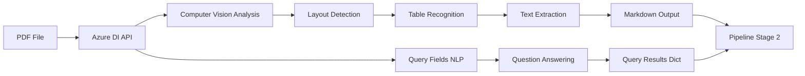

# Clinical AI Pipeline for DILI Extraction: Comprehensive Technical Manual

This manual provides an in-depth exploration of the architecture, logic, and implementation of the clinical data extraction system. It is divided into three core sections: Azure Document Intelligence integration, LLM extraction strategy, and output validation/formatting.

---

# Section 1: Azure Document Intelligence - Deep Dive

## Overview

Azure Document Intelligence (formerly Form Recognizer) is Microsoft's cloud-based OCR and document understanding service. We use it to convert PDF documents into structured markdown while extracting specific data points through Query Fields.

## Architecture: How Azure DI Fits In



## Code Structure: `layout_parser.py`

### Class Structure

```python
class LayoutParser:
    def __init__(self):
        # 1. Initialize Azure client
        # 2. Define Query Fields
    
    def analyze_document(self, file_path: str) -> Tuple[str, Dict]:
        # 3. Call Azure API
        # 4. Parse results
        # 5. Return markdown + query results
```

## Step-by-Step Code Explanation

### Step 1: SDK Initialization
We use the `azure-ai-documentintelligence` SDK (v1.0+) to communicate with the Azure service. The client handles HTTP requests, retries, and error handling.

### Step 2: Query Fields Definition
Query Fields allow us to ask natural language questions directly to the document. This is more accurate than LLM extraction for numeric values like "Median PFS" or "Plasma Protein Binding %".

**Query Design Best Practices:**
1. **Be specific**: "median PFS in months" > "PFS"
2. **Include synonyms**: "t1/2 or elimination half-life"
3. **Specify units**: "percentage", "months", "mg/m²"
4. **Avoid ambiguity**: "Grade 3-4 Anemia rate" > "Anemia"

### Step 3: API Call
The system calls the `prebuilt-layout` model with `output_content_format="markdown"` and `features=[DocumentAnalysisFeature.QUERY_FIELDS]`. This ensures we get both the full document structure and the specific answers we need.

### Step 4: How Query Fields Work (Under the Hood)

#### Azure's Query Fields Pipeline
Azure identifies relevant sections (e.g., "Progression-Free Survival"), understands semantic context ("median" = middle value), and extracts the precise value with a confidence score.

### Step 5: Response Parsing
Azure returns a `DocumentField` object for each query with the content and confidence. We map these results back into our pipeline's internal data structure.

## Summary of Stage 1
Azure Document Intelligence provides high-fidelity markdown conversion, maintains table relationships, and uses specialized NLP to answer mission-critical data extraction questions.

---

# Section 2: Extraction Logic & Smart Chunking - Deep Dive

## Overview

Stage 3 is the engine of the system. It takes the parsed markdown and converts it into structured clinical data. The primary challenges are **document size** (overwhelming the LLM's context window) and **extraction speed**.

## 🏗️ The Problem: Context Window vs. Document Size

Large clinical documents (200+ pages) exceed the context limits of most LLMs. To solve this, we use **Smart Chunking** combined with **Async Parallel Extraction**.

## 1. Smart Chunking Strategy
The filtered document is split into manageble pieces.
- **Chunk Size**: 4,000 characters (~1,000 tokens). Large enough for tables, small enough for precision.
- **Overlap**: 500 characters. Ensures that context split at boundaries (like a table row) is captured in at least one chunk.

## 2. Async Parallel Extraction
Instead of processing chunks one by one, the system sends all chunks to GPT-4o (via Azure OpenAI) concurrently.
- **Efficiency**: Reduces total extraction time from minutes to ~5 seconds of LLM execution.
- **Reliability**: Uses GPT-4o's superior accuracy and structured output capabilities.

## 3. GPT-4o & Pydantic
We use strict **Pydantic Models** to enforce type safety. GPT-4o acts as a "Clinical Data Auditor" that fills in the slots defined by our schema using Azure OpenAI's function calling feature.

## 4. Hierarchical Merging Strategy
Since each chunk only "sees" a tiny slice of the document, results are fragmented. The pipeline uses a recursive merging algorithm:
1. **Lists (Tables)**: Aggregates unique study entries and demographics.
2. **Dictionaries**: Updates mission-critical fields, prioritizing non-null values.

## 5. Summary of Stage 3 Logic
The system filters for relevance, splits for scale, extracts in parallel, and merges with high-fidelity de-duplication to reconstruct the full clinical profile.

---

# Section 3: Validation & Professional Output - Deep Dive

## Overview

The final stage transforms raw AI extraction into a standardized, polished product through **Standardization** and **Structured Writing**.

## 1. The Validator: Data Grooming
AI can produce inconsistent formats. The Validator cleans this up using rule-based heuristics:
- **Percentage Normalization**: Ensures "25.6" becomes "25.6%".
- **Date Consolidation**: Standardizes medical study periods (e.g., "14-Apr-2009 to 11-Apr-2013").
- **Null Handling**: Converts "null" or "N/A" into a consistent format for Excel reporting.

## 2. Multi-Sheet Excel Generation
Instead of a single overwhelming CSV, the system creates a professional **Structured Excel Workbook** with 11 sheets:
- **Study Metadata**: Phase, Status, Indication.
- **Efficacy**: ORR, CR, PR, PFS, OS metrics.
- **Pharmacokinetics**: t1/2, Clearance, Volume of Distribution.
- **Demographics**: Participant baseline characteristics.
- **Detailed Safety**: Flattened grid of all adverse events (TEAEs, SAEs, etc.).

## 3. Table Flattening Logic
To make nested JSON readable in Excel, the writer flattens hierarchical structures into a clean grid:
`Group -> Table Type -> Event -> Rate` becomes a table where each row is a unique observation.

## Final Summary
The Clinical AI Pipeline results in two synchronized outputs:
1. **JSON**: A high-fidelity, machine-readable data structure.
2. **Excel**: A boardroom-ready workbook designed for manual medical review.

---
*Manual compiled by the Clinical AI Pipeline Team.*
